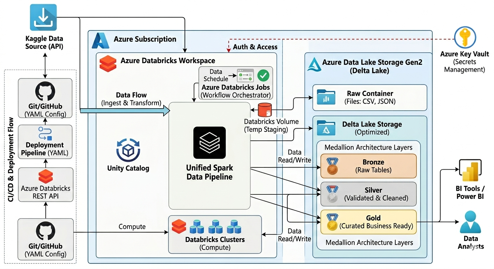
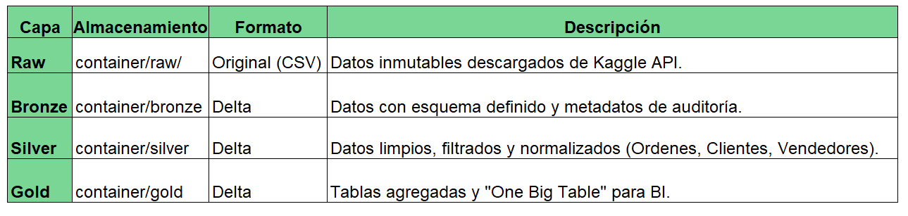

# 🛒 ETL Ecommerce Brazilian

Pipeline automatizado de datos para análisis de ordenes y la suma de las ventas en Brasil con arquitectura de tres capas y despliegue continuo.

##🎯 Descripción

Este proyecto implementa un pipeline ETL que procesa datos de órdenes, clientes y vendedores. Utiliza la Arquitectura Medallion (Bronze-Silver-Gold) con una capa inicial Raw para la ingesta desde la API de Kaggle. Todo el ciclo de vida está automatizado con GitHub Actions y asegurado con Azure Key Vault.

##✨ Características Principales

🔄 ETL Automatizado - Pipeline completo vía GitHub Actions.

🏗️ Arquitectura Medallion - Flujo estructurado: Raw → Bronze → Silver → Gold.

📊 Modelo Dimensional - Transformación a One Big Table optimizada para analítica.

🚀 CI/CD Nativo - Despliegue automático en cada push a la rama main.

⚡ Delta Lake - Garantía de transacciones ACID y Time Travel.

🔐 Seguridad Enterprise - Gestión de secretos con Azure Key Vault.

## 🏛️ Arquitectura del Sistema
Flujo de Datos

##🛠️ Configuración del Entorno (Setup)
Para que el pipeline de CI/CD funcione correctamente, sigue estos pasos de configuración:

1️⃣ Configurar Azure Key Vault
Los secretos sensibles se gestionan fuera del código:

kaggle-key: Token de la API de Kaggle.

kaggle-user: User de Kaggle.

2️⃣ Generar Databricks TokenPara permitir que GitHub Actions se comunique con tu Workspace:

1. Entra a tu Databricks Workspace.
2. Ve a User Settings → Developer → Access Tokens.
3. Haz clic en Generate New Token.
4. Configuración:
* Comment: GitHub CI/CD
* Lifetime: 90 days (recomendado).
5.⚠️ Importante: Copia y guarda el token de inmediato; no podrás verlo de nuevo.

3️⃣ Configurar GitHub Secrets

Registrar las credenciales en tu repositorio de GitHub para habilitar el despliegue automático:
* Settings → Secrets and variables → Actions.
* Crear los siguientes Repository Secrets:
  * DATABRICKS_HOST https://adb-xxxxx.azuredatabricks.netURL de la instancia de Databricks.
  * DATABRICKS_TOKEN api_xxxxxxxxxxxxxxxxxxxxxxEl token generado en el paso anterior.

🚀 Ciclo de Vida y Producción (CI/CD)
El proyecto gestiona la transición entre entornos de forma dinámica mediante el archivo .yml de configuración.

🔄 Multi-Entorno (Environment Switching)
El pipeline detecta el entorno y apunta al Data Lake correspondiente:

Dev: abfss://raw@adlssmartprojectdev13.dfs.core.windows.net/

Prod: abfss://raw@adlssmartproject13prod.dfs.core.windows.net/

🛠️ Flujo de GitHub Actions
Al realizar un merge a main, se dispara el siguiente proceso:

Linting & Testing: Validación de sintaxis y lógica en los Notebooks.

Asset Bundles (DABs): Empaquetado de recursos y configuración de Jobs.

Deployment: La Databricks REST API actualiza los Workflows en producción automáticamente.

##📂 Estructura del Data Lake (ADLS Gen2)

## 🔄 Workflow Databricks

⏰ Schedule: Diario 4:00 AM (Bogota) ⏱️ Timeout total: 30 horas 🔒 Max concurrent runs: 2

📈 Dashboards
https://github.com/oscarduque9713/CICD-Databricks/tree/main/Dashboard

👤 Autor
Oscar Eduardo Duque Ospina
