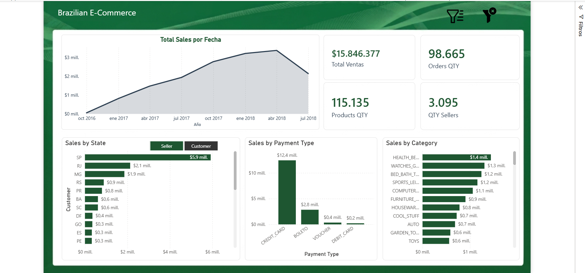
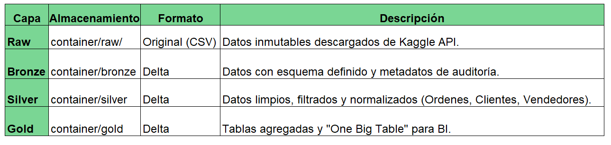
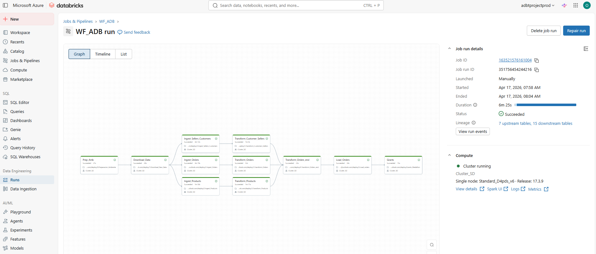

# 🛒 ETL Ecommerce Brazilian

Pipeline automatizado de datos para el análisis de órdenes y ventas en Brasil, utilizando una arquitectura de datos moderna basada en Lakehouse, despliegue continuo (CI/CD) y compartición segura de datos.

## 🎯 Resumen del Proyecto

Este ecosistema transforma datos crudos de e-commerce en insights accionables. El flujo comienza con la ingesta desde la API de Kaggle, transita por una Arquitectura Medallion en Azure Databricks y finaliza con un tablero en Power BI conectado mediante Delta Sharing.

## ✨ Características Principales

- 🔄 ETL Automatizado: Ingesta desde Kaggle API y procesamiento orquestado.

- 🏗️ Arquitectura Medallion: Capas Raw → Bronze → Silver → Gold.

- 🚀 CI/CD: Despliegue automático usando Databricks Asset Bundles y GitHub Actions.

- 🔐 Seguridad Robusta: Integración nativa con Azure Key Vault para manejo de secretos.

- 📊 Consumo Analytics: Conectividad avanzada con Power BI a través de Delta Sharing.

- ⚡ Delta Lake: Transacciones ACID, Schema Enforcement y Time Travel.

## 🏛️ Arquitectura del Sistema
Flujo de Datos

📂 Estructura del Proyecto
La organización del repositorio sigue las mejores prácticas de modularización para proyectos de Ingeniería de Datos en Databricks:

databricks_project/
├── notebooks/                   # Lógica de transformación Spark
│   ├── bronze/
│   │   └── 01_ingest_raw.py     # Ingesta desde Volume/Raw a Delta
│   ├── silver/
│   │   └── 02_clean_transform.py # Limpieza y normalización
│   └── gold/
│       └── 03_aggregate_metrics.py # Modelado dimensional (OBT)
├── config/                      # Configuraciones globales
│   └── settings.py              # Variables de entorno y rutas ADLS
├── .github/                     # Automatización CI/CD
│   └── workflows/
│       └── databricks_cicd.yml  # Definición del pipeline de despliegue
└── README.md                    # Documentación del proyecto

Ciclo de Vida del Dato

  1. Ingesta (Raw): Descarga vía API de Kaggle, almacenamiento en Databricks Volumes y persistencia en Azure Data Lake Gen2 (ADLS).

  2. Validación (Bronze): Datos crudos en formato Delta con metadatos de auditoría.

  3. Refinado (Silver): Limpieza, tipado y modelado dimensional.

  4. Agregación (Gold): Creación de la One Big Table (OBT) optimizada para negocio.

  5. Exposición: Uso de Delta Sharing para servir datos a Power BI sin mover archivos.

## ⚙️ Pre-requisitos y Configuración

1. Configuración del Cluster

Debido al uso de una suscripción gratuita, se utilizan clusters existentes (All-Purpose) para optimizar costos.

  - Librerías: Es obligatorio instalar manualmente la librería kaggle vía PyPI en los clusters de Dev y Prod.

  - Nota: El archivo .yml de orquestación apunta a los IDs de estos clusters pre-configurados.

2. Seguridad (Azure Key Vault)

Configura un Secret Scope en Databricks vinculado a Key Vault con los siguientes secretos:

  - kaggle-user: Nombre de usuario de la API.

  - kaggle-key: Token de acceso de la API.

3. CI/CD Setup (GitHub Secrets)

Para habilitar el despliegue automático, configura estos secretos en tu repositorio:

  - DATABRICKS_HOST: URL de tu workspace (ej. https://adb-xxx.azuredatabricks.net).

  - DATABRICKS_TOKEN: Token de acceso generado en User Settings.

## 🚀 Despliegue y Orquestación

### Multi-Entorno dinámico

El pipeline identifica el entorno y conmuta los endpoints del Data Lake automáticamente:

Dev: abfss://raw@adlssmartprojectdev13.dfs.core.windows.net/

Prod: abfss://raw@adlssmartproject13prod.dfs.core.windows.net/

### Workflow en Producción

⏰ Horario: Diario 04:00 AM (Bogotá).

⏱️ SLA: ~25 Minutos.

🔒 Concurrencia: Máximo 2 ejecuciones.

## 📈 Visualización y Entrega de Datos
El cierre del pipeline se realiza en Power BI, utilizando una arquitectura desacoplada:

- Método de Conexión: Delta Sharing (Protocolo abierto para compartir datos).

- Beneficio: Acceso en tiempo real a la capa Gold sin necesidad de refrescos de extracción pesados.

- Dashboard:   
https://github.com/oscarduque9713/CICD-Databricks/tree/main/Dashboard

## 📂 Estructura del Data Lake (ADLS Gen2)

## 🔄 Workflow Databricks

### 👤 Autor

Oscar Eduardo Duque Ospina
